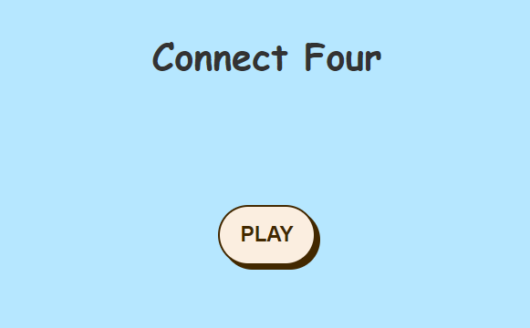

# Connect Four Game
## [GitHub](https://github.com/Hamad-Alfandi/Connect-Four) 
## [Website for the game](https://connectfor4game.surge.sh/)
### Description:
Connect Four is a classic two-player strategy game that involves dropping colored discs into a vertically suspended grid. The grid consists of six rows and seven columns, creating a captivating challenge for players. The objective is to connect four of one's own discs horizontally, vertically, or diagonally before the opponent does. Players take turns choosing a column in which to drop their disc, and the disc will fall to the lowest available space within that column. The game requires strategic thinking and foresight, as players aim to block their opponent's moves while setting up their own winning combinations. With its simple rules and engaging gameplay, Connect Four provides an entertaining and competitive experience for players of all ages.

### Screenshots:

1- Click PLAY to get started:



2- Play game screen:


3- When one of the player win:


### Technologies Used:
* HTML
* CSS
* JS

### Future plans:
* Add some animations to discs.

### Piece of code:
 ```
 const dialog = () => {
    // Check dialog (top-left to bottom-right)
    for (let row = 0; row < 3; row++) {
      for (let col = 0; col < 4; col++) {
        if (
          board[row][col] === 1 &&
          board[row + 1][col + 1] === 1 &&
          board[row + 2][col + 2] === 1 &&
          board[row + 3][col + 3] === 1
        ) {
          playerWin()
        } else if (
          board[row][col] === 2 &&
          board[row + 1][col + 1] === 2 &&
          board[row + 2][col + 2] === 2 &&
          board[row + 3][col + 3] === 2
        ) {
          playerWin()
        }
      }
    }

    for (let r = 0; r < 3; r++) {
      for (let c = 6; c > 2; c--) {
        if (
          board[r][c] == 1 &&
          board[r + 1][c - 1] == 1 &&
          board[r + 2][c - 2] == 1 &&
          board[r + 3][c - 3] == 1
        ) {
          playerWin()
        } else if (
          board[r][c] == 2 &&
          board[r + 1][c - 1] == 2 &&
          board[r + 2][c - 2] == 2 &&
          board[r + 3][c - 3] == 2
        ) {
          playerWin()
        }
      }
    }
  }
  ```